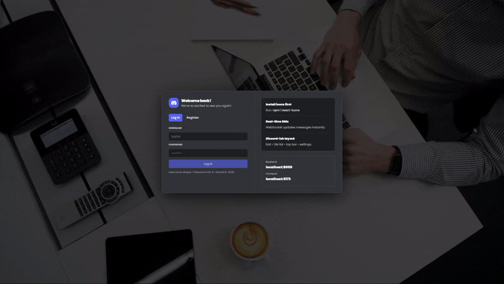
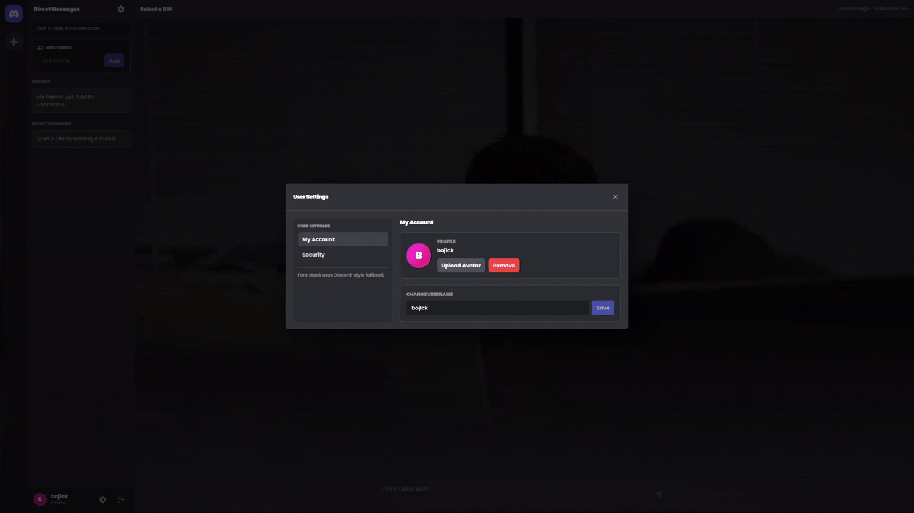

# Discord JSON Chat

A Discord-like chat platform built with React + FastAPI, storing everything in JSON (no database).

This project is made for learning, experimenting, and showcasing a real-time chat system with a Discord-style UI.

---

## Features

- Register & Login (username + password)
- Unique usernames
- Add friends by username
- Direct Messages (DMs)
- Real-time chat using WebSockets
- Upload / change profile picture
- Account settings
  - Change username
  - Change password
  - Remove avatar
- Discord-like UI (sidebar, DM list, chat view)
- No database — everything stored in JSON files

---

## Tech Stack

Frontend:
- React
- Vite
- TypeScript
- Tailwind CSS
- react-icons
- Poppins font

Backend:
- FastAPI
- WebSockets
- Python
- JSON file storage
- passlib (password hashing)

---

## Project Structure

discord-json-chat/
├── backend/
│   ├── main.py
│   ├── requirements.txt
│   └── data/
│       ├── users.json
│       ├── sessions.json
│       ├── dms.json
│       └── messages.json
│
├── frontend/
│   ├── index.html
│   ├── package.json
│   ├── vite.config.ts
│   └── src/
│       ├── App.tsx
│       ├── main.tsx
│       └── index.css
│
└── README.md

---

## Run Locally

### Backend (FastAPI)

cd backend
python -m venv .venv

Windows:
.venv\Scripts\activate

macOS / Linux:
source .venv/bin/activate

pip install -r requirements.txt
uvicorn main:app --reload --port 8000

Backend URL:
http://localhost:8000

---

### Frontend (React)

cd frontend
npm install
npm run dev

Frontend URL:
http://localhost:5173

---

## Important Notes

- Data is stored in JSON files
- Not intended for production use
- No rate limiting
- No email verification
- No encryption at rest

This is intentional for simplicity and learning purposes.

---

## Security

- Passwords are hashed using bcrypt
- Token-based authentication
- WebSocket authentication via token

---

## Screenshots / Preview

### Register

### Login

### Upload profile picture & Settings

---

## License

MIT License

---

## Author

Built by SALAH EDDINE EN-NOUAMI  
Discord-inspired chat application using React, FastAPI, and JSON storage.
